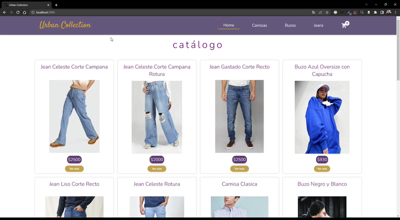

# E-COMMERCE URBAN COLLECTION

## Descripcion

	Aplicación de e-commerce realizada en React. Trabaja conectada a Firebase para la consumición
	de productos ofrecidos en la web como también para guardar las órdenes de compra generadas por los usuarios.
	Desde la vista detallada del producto, se selecciona la cantidad deseada y se agrega al carrito. Luego desde la sección del carrito se rellena el formulario y se genera la orden de compra obteniendo el código de confirmación.

## Instalación / Uso

	Para utilizar ésta aplicación seguir los siguientes pasos desde la terminal:
	
	$ git clone https://github.com/sjcarrozzo/proyecto-urban-collection
	$ cd proyecto-urban-collection/
	$ npm start

## Tecnologías usadas
    "firebase": "^9.14.0", para conexion a firebase
    "react-hook-form": "^7.39.6", para validacion de formularios
    "react-router-dom": "^6.4.2", para definicion de rutas
